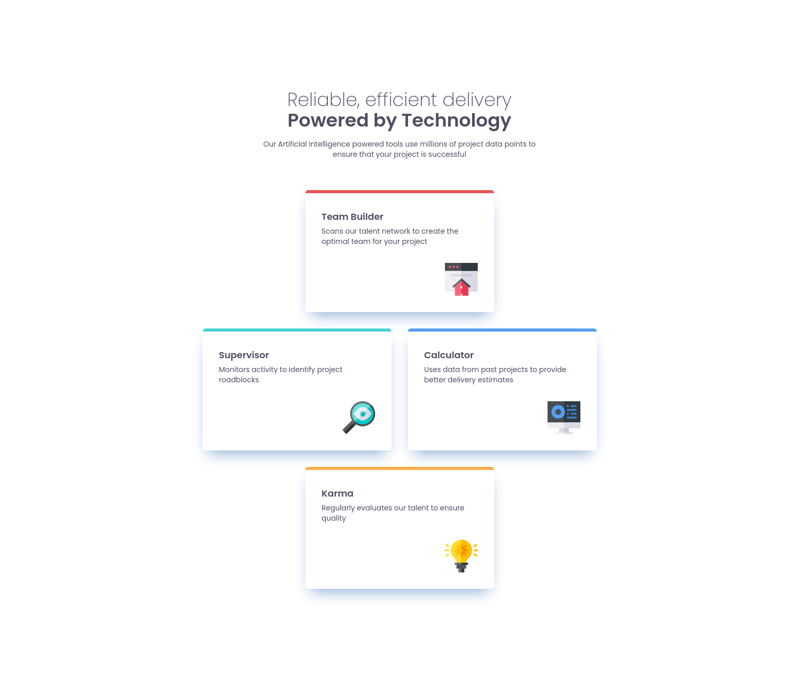

# Frontend Mentor - Four card feature section solution

This is a solution to the [Four card feature section challenge on Frontend Mentor](https://www.frontendmentor.io/challenges/four-card-feature-section-weK1eFYK).

## Table of contents

- [Overview](#overview)
  - [The challenge](#the-challenge)
  - [Screenshot](#screenshot)
  - [Links](#links)
- [My process](#my-process)
  - [Built with](#built-with)
  - [What I learned](#what-i-learned)
  - [Continued development](#continued-development)

## Overview

This is a small section built with the aim of using grid to create a responsive four card layout

### The challenge

Users should be able to:

- View the optimal layout for the site depending on their device's screen size

### Screenshot

### Links

- Solution URL: [Add solution URL here](https://github.com/JVarney03/webdev-four-card-feature)
- Live Site URL: [Add live site URL here](https://jvarney03.github.io/webdev-four-card-feature/)

### Built with

- Semantic HTML5 markup
- CSS custom properties
- [Tailwind](https://tailwindcss.com)
- [Vite](https://vite.dev)

